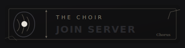

  <table border="0" cellpadding="0" cellspacing="15" style="background-color: #121214; padding: 20px; border-radius: 12px; box-shadow: 0 0 40px rgba(0,0,0,0.8);">
    <tr>
      <td width="50%" style="padding: 0;">
        
      </td>
      <td width="50%" style="padding: 0;">
        
      </td>
    </tr>
    <tr>
      <td colspan="2" style="padding: 0;">
        
      </td>
    </tr>
  </table>

