<br>

<!-- КНОПКИ В НОВОМ СТИЛЕ -->
<div align="center">
  <a href="https://0xavia.xyz">
    
  </a>
  &nbsp;&nbsp;&nbsp;&nbsp;
  <a href="https://discord.gg/z5j6quvKj6">
    
  </a>
</div>

<br><br>

<!-- БАННЕР ЯЗЫКОВ -->
<div align="center">
  
</div>

<br>

<!-- СТАТИСТИКА GITHUB (Стилизована под новый HUD) -->
<div align="center">
  
  
</div>

<br>

```text
> EXECUTING PROFILE_SCAN...
[OK] Identity verified.
[OK] Loading modules...

I build high-performance, low-level systems. 
No mercy for bad code. Proprietary logic locked.
```

<br>
<div align="center">
  <sub>// SYS.DIAGNOSTICS // UPLINK ESTABLISHED //</sub>
</div>
