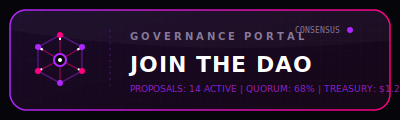

<div align="center">

```text
  __      __     ______     __         __     ______    
 /\ \  _ \ \   /\  == \   /\ \       /\ \   /\  ___\   
 \ \ \/ ".\ \  \ \  __<   \ \ \____  \ \ \  \ \___  \  
  \ \__/".~\_\  \ \_____\  \ \_____\  \ \_\  \/\_____\ 
   \/_/   \/_/   \/_____/   \/_____/   \/_/   \/_____/ 
   [ DECENTRALIZED IDENTITY VERIFIED ... WELCOME TO THE VOID ]
```

</div>

<br>

<!-- КНОПКИ В WEB3 СТИЛЕ -->
<div align="center">
  <a href="https://0xavia.xyz">
    
  </a>
  &nbsp;&nbsp;&nbsp;&nbsp;
  <a href="https://discord.gg/z5j6quvKj6">
    
  </a>
</div>

<br><br>

<!-- БАННЕР ЯЗЫКОВ -->
<div align="center">
  
</div>

<br>

<!-- WEB3 ТЕХНОЛОГИИ -->
<div align="center">
  
  
  
  
</div>

<br>

```javascript
// EXECUTING PROFILE_SCAN.js
const identity = await web3.eth.accounts.recover(hash, sig);
if (identity === "0xavia") {
    console.log("[OK] Access Granted. Loading proprietary modules...");
    console.log("[OK] Building high-performance, low-level systems.");
    console.log("[!] Warning: No mercy for bad code. Logic locked.");
}
```

<br>

<!-- СТАТИСТИКА GITHUB (Темная Web3 тема) -->
<div align="center">
  
  
</div>

<br>

<div align="center">
  <sub style="color: #4A5B7C; font-family: monospace;">// CONSENSUS REACHED · BLOCK #19283749 //</sub>
</div>
